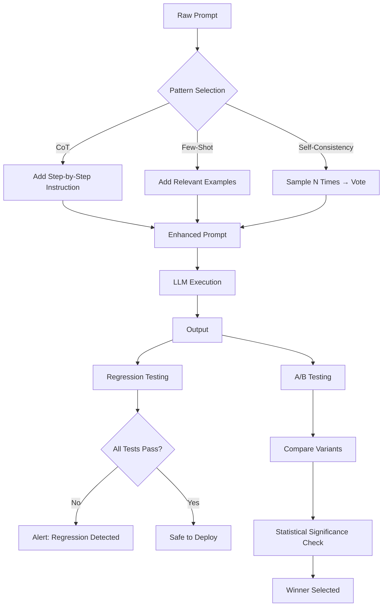

# AI GenAI Prompt Engineering Patterns

Production prompt engineering framework with CoT, few-shot, self-consistency patterns, A/B testing, regression testing, and prompt versioning.

## Table of Contents
1. [Overview](#overview)
2. [Project Structure](#project-structure)
3. [Patterns](#patterns)
4. [Deployment](#deployment)
5. [API Reference](#api-reference)
6. [Testing](#testing)

---

## End-to-End Flow



---

## Patterns

| Pattern | Description | Best For |
|---------|-------------|----------|
| Chain-of-Thought | Step-by-step reasoning | Math, logic, complex reasoning |
| Few-Shot | Input-output examples | Classification, formatting |
| Self-Consistency | Multiple samples + majority vote | High-confidence answers |

---

## Project Structure

```
ai-genai-prompt-engineering-patterns/
├── src/prompt_engineering/
│   ├── patterns/
│   │   ├── chain_of_thought.py  # CoT zero-shot and manual
│   │   ├── few_shot.py          # Example-based prompting
│   │   └── self_consistency.py  # Majority voting
│   ├── testing/
│   │   ├── regression.py        # Prompt regression tests
│   │   └── ab_test.py           # A/B statistical comparison
│   ├── api/router.py
│   └── main.py
├── tests/
├── config/
├── pyproject.toml, Dockerfile, docker-compose.yml
```

---

## Deployment

```bash
poetry install && cp .env.example .env
poetry run python -m uvicorn prompt_engineering.main:app --reload --port 8000
poetry run pytest
docker-compose up --build
```

---

## API Reference

| Endpoint | Description |
|----------|-------------|
| POST /api/v1/prompts/patterns/cot | Apply Chain-of-Thought |
| POST /api/v1/prompts/patterns/few-shot | Build few-shot prompt |
| POST /api/v1/prompts/patterns/self-consistency/vote | Majority vote |
| POST /api/v1/prompts/testing/ab-test | A/B test comparison |

---

## Testing

```bash
poetry run pytest --cov=src/prompt_engineering --cov-report=term-missing
```
